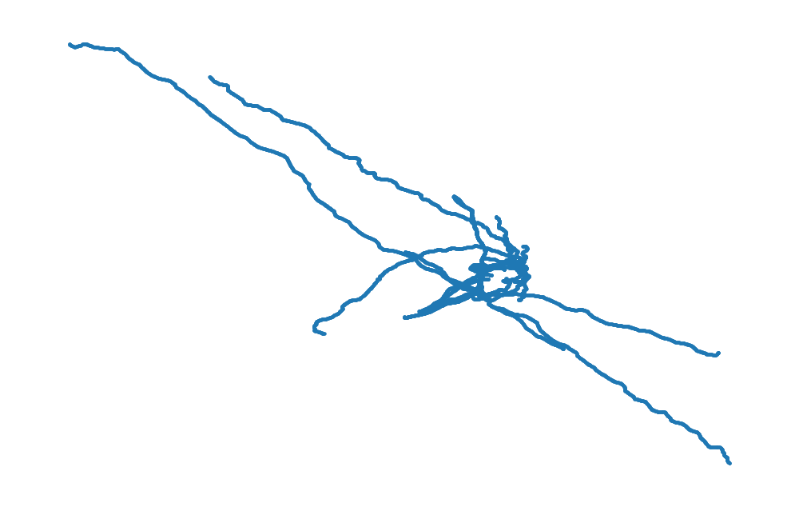
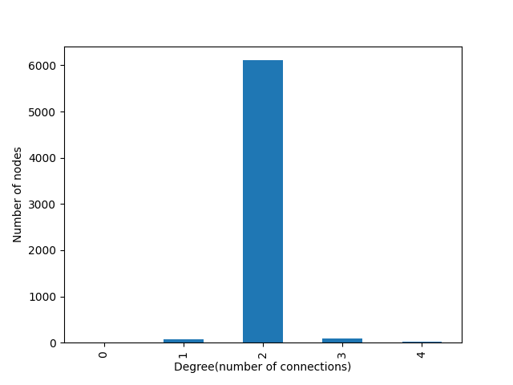
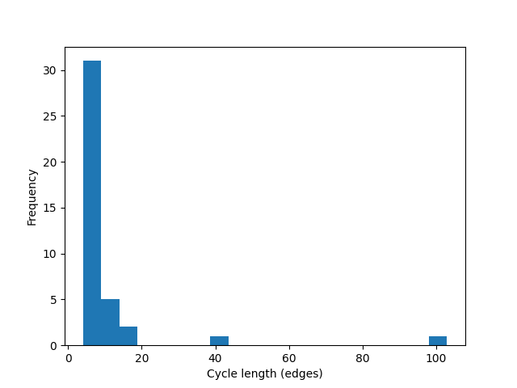

# Grid-topology-analysis-lucknow
Graph-based power grid topology analysis using OpenStreetMap and NetworkX. Includes connectivity, cycle structure, and network metrics for real-world transmission infrastructure.

This project builds a graph-based model of the electrical transmission network in Lucknow using real-world data from OpenStreetMap.

It converts raw geospatial power infrastructure data into a network graph, enabling structural analysis of the grid such as connectivity, cycles, and topology.

Core idea:
Treat the power grid like a network → analyze it like a system → unlock intelligence.

---

##  What This Project Does

### 1. Data Extraction
- Source: OpenStreetMap (via OSMnx)
- Extracts:
  - Substations
  - Transmission lines
- Filters high-voltage lines (132kV, 220kV, 400kV)

---

### 2. Graph Construction
- Nodes → Electrical buses (from coordinates)
- Edges → Transmission lines
- Built using NetworkX

---

### 3. Network Analysis

- Nodes: 6285
- Edges: 6313
- Connected Components: 12
- Average Degree: ~2.01
- Planarity: True
- Cycles: 40
- Average Cycle Length: 9.3

---

### 4. Matrix Representations

- Adjacency Matrix → Connectivity
- Incidence Matrix → Node-edge relation
- Laplacian Matrix → Structural properties

Shapes:
- Adjacency: (6285 × 6285)
- Incidence: (6285 × 6313)
- Laplacian: (6285 × 6285)

---

### 5. Visualization
- Graph plots using matplotlib
- Subgraph (connected components) visualization
- Geographic layout using coordinates

---
## 📊 Results & Visualizations

### Grid Topology Map

### Degree Distribution

### Cycle Length Distribution

##  Usage

python src/main.py

---

##  Key Insights

- 12 disconnected components → fragmented grid structure
- Average degree ≈ 2 → low redundancy
- Only 40 cycles → weak loop structure
- Planar graph → simplified representation (not fully realistic)

---

##  Limitations

- OSM data may be incomplete
- No electrical parameters (impedance, load, generation)
- No power flow simulation
- HVDC links not included

##  Tech Stack

- Python
- NetworkX
- OSMnx
- Pandas
- NumPy
- Matplotlib

---

## 👤 Author

Aditya  
Electrical Engineering + AI  

---
